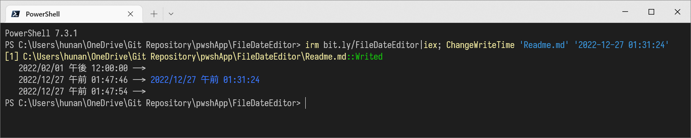

變更檔案 建立日期 修改日期 存取日期
===


## 快速使用

修改檔案日期
```ps1
irm bit.ly/4gkzM5D|iex; Get-Item 'test/file.txt' | Set-FileDate '2025-2-3'
```

查看檔案日期
```ps1
Get-Item 'test/file.txt' | Select-Object Name, CreationTime, LastWriteTime, LastAccessTime
```
